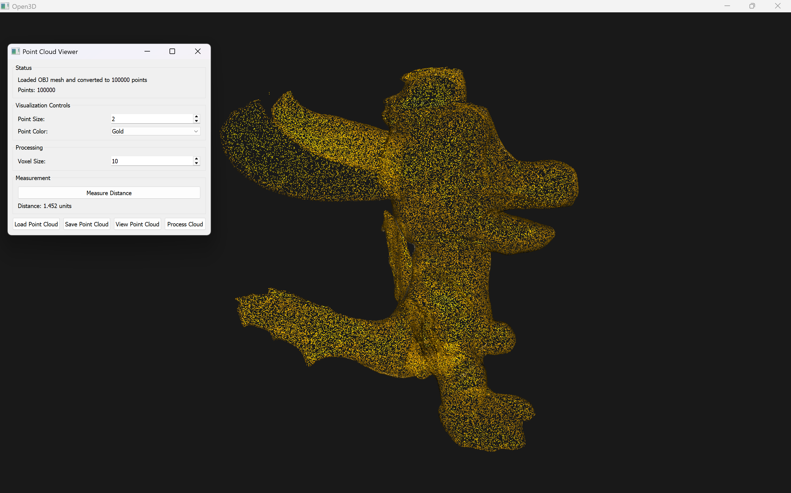

# Point Cloud Visualizer

A powerful and user-friendly point cloud visualization tool built with Python, leveraging Open3D and PyQt5.

## Features

- Support for multiple file formats (PLY, PCD, OBJ)
- Interactive 3D visualization with customizable styles
- Precise distance measurement tools
- Point cloud processing capabilities
- Real-time point cloud manipulation
- Multiple color schemes and visualization options
- Efficient point cloud downsampling
- Mesh to point cloud conversion

## Screenshots




## Quick Start

### Prerequisites
- Python 3.7 or higher
- Git (for cloning the repository)

### Installation

1. Clone the repository:
```bash
git clone https://github.com/shinas07/point-cloud-visualizer.git
cd point-cloud-visualizer
```

2. Create and activate a virtual environment:
```bash
# Create virtual environment
python -m venv venv

# Activate on Windows
venv\Scripts\activate

# Activate on Unix or MacOS
source venv/bin/activate
```

3. Install dependencies:
```bash
pip install -r requirements.txt
```

### Running the Application
```bash
python src/main.py
```

## Usage Guide

### Loading Files
1. Click "Load Point Cloud" button
2. Select a supported file (PLY, PCD, or OBJ)
3. For OBJ files, specify the number of points to sample

### Visualization Controls
- **Point Size**: Adjust using the spinner control
- **Color**: Choose from predefined color schemes
- **View Navigation**:
  - Rotate: Left mouse button
  - Pan: Right mouse button
  - Zoom: Mouse wheel

### Measurement Tool
1. Click "Measure Distance" button
2. Hold SHIFT and select two points
3. Press 'Q' to complete measurement
4. Distance will be displayed in the UI

### Processing Options
- **Downsample**: Adjust voxel size and process

## Project Structure

```
point-cloud-visualizer/
├── src/
│   ├── main.py                # Application entry point
│   ├── ui/
│   │   └── main_window.py     # Main UI implementation
│   └── utils/
│       └── point_cloud_utils.py  # Utility functions
├── requirements.txt           # Project dependencies
└── README.md                  # Project documentation
```

## Advanced Features

### OBJ File Processing
- Automatic mesh to point cloud conversion
- Configurable point sampling density
- Normal estimation for better visualization

### Point Cloud Processing
- Downsampling with configurable voxel size
- Normal estimation
- Outlier removal
- Custom color schemes

## Acknowledgments
- [Open3D](http://www.open3d.org/) for the powerful 3D processing library
- [PyQt5](https://www.riverbankcomputing.com/software/pyqt/) for the GUI framework
- Stanford Computer Graphics Laboratory for the bunny model
